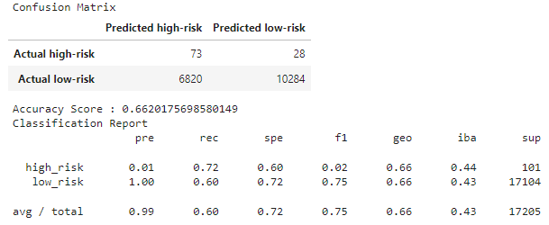
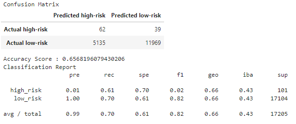
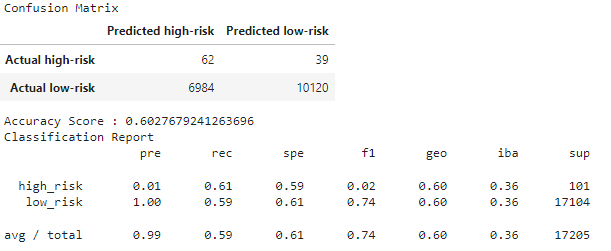
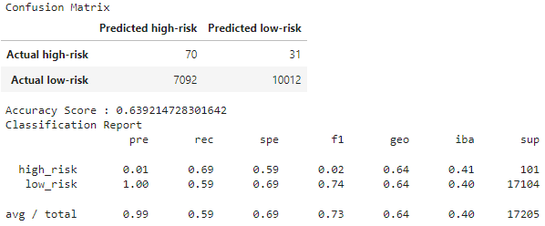
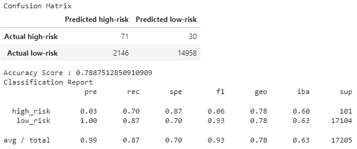
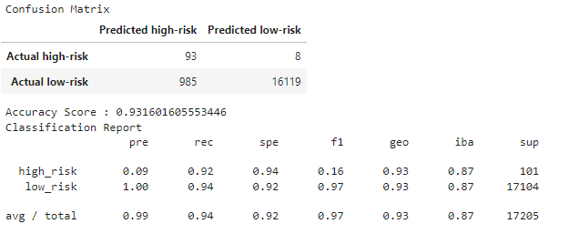

# Credit Risk Analysis

## Overview
The Python scikit-learn and imbalanced-learn machine learning libraries were used to assess credit card risk based on features such as loan amount, interest, etc. The model target was the 'loan_risk', which can be either 'high-risk' or 'low-risk'. Data was analyzed using six different supervised machine learning models:

- [Resampling Models](credit_risk_resampling.ipynb)
  - Naive Random Oversampling
  - SMOTE Oversampling
  - Cluster Centroid Undersampling
  - SMOTEENN Combination Sampling
- [Ensemble Models](credit_risk_ensemble.ipynb)
  - Balanced Random Forest Classification
  - Easy Ensemble with AdaBoosting

The results of each model were assessed based on balanced accuracy, precision, and recall scores. The subsequent Analysis section is divided up by model analysis. Each section contains tables and screenshots of model assessment metrics (i.e. balanced accuracy scores, precision scores, recall scores, confusion matrices, classification reports). The Summary section summarizes these results and the resulting model recommendation.

## Analysis
=== Logistic Regression Model with Resampling
=== Naive Random Oversampling 
- Balanced Accuracy Score: <b>0.6620175698580149</b>

| Outcome    | Precision Score | Recall Score  |
|:----------:|:---------------:|:-------------:|
| high-risk  | 0.01            | 0.72          |
| low-risk   | 1.00            | 0.60          |
  

#### SMOTE Oversampling
- Balanced Accuracy Score: <b>0.6568196079430206</b>

| Outcome    | Precision Score | Recall Score  |
|:----------:|:---------------:|:-------------:|
| high-risk  | 0.01            | 0.61          |
| low-risk   | 1.00            | 0.70          |

#### Cluster Centroid Undersampling
- Balanced Accuracy Score: <b>0.6027679241263696</b>

| Outcome    | Precision Score | Recall Score  |
|:----------:|:---------------:|:-------------:|
| high-risk  | 0.01            | 0.61          |
| low-risk   | 1.00            | 0.59          |

#### SMOTEENN Combination Sampling
- Balanced Accuracy Score: <b>0.7887512850910909</b>

| Outcome    | Precision Score | Recall Score  |
|:----------:|:---------------:|:-------------:|
| high-risk  | 0.03            | 0.70          |
| low-risk   | 1.00            | 0.87          |

### Ensemble Models
#### Balanced Random Forest Classification
- Balanced Accuracy Score: <b>0.7887512850910909</b>

| Outcome    | Precision Score | Recall Score  |
|:----------:|:---------------:|:-------------:|
| high-risk  | 0.03            | 0.70          |
| low-risk   | 1.00            | 0.87          |

- Top 10 Importance Features According to RF Model

| Feature          | Importance           |
|:----------------:|:--------------------:|
| total_rec_prncp  | 0.07876809003486353  |
| total_pymnt      | 0.05883806887524815  |
| total_pymnt_inv  | 0.05625613759225244  |
| total_rec_int    | 0.05355513093134745  |
| last_pymnt_amnt  | 0.0500331813446525   |
| int_rate         | 0.02966959508700077  |
| issue_d_Jan-2019 | 0.021129125328012987 |
| installment      | 0.01980242888931366  |
| dti              | 0.01747062730041245  |
| out_prncp_inv    | 0.016858293184471483 |

#### Easy Ensemble with AdaBoost 
- Balanced Accuracy Score: <b>0.931601605553446</b>

| Outcome    | Precision Score | Recall Score  |
|:----------:|:---------------:|:-------------:|
| high-risk  | 0.09            | 0.92          |
| low-risk   | 1.00            | 0.94          |

## Summary

## Resources
- Data
  - [LoanStats_2019Q1.csv](LoanStats_2019Q1.csv)
- Notebooks
  - [credit_risk_resampling.ipynb](credit_risk_resampling.ipynb)
  - [credit_risk_ensemble.ipynb](credit_risk_ensemble.ipynb)
- Software
  - Jupyter Notebook
